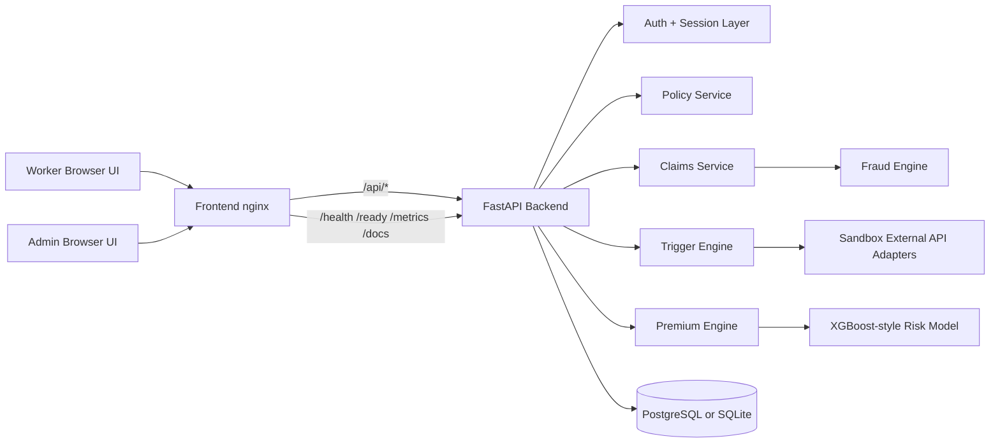
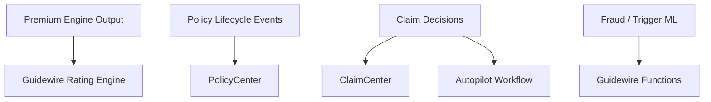

# GigShield Architecture

This document describes the architecture that exists in the repo today, plus the clear extension points for the DEVTrails Guidewire story.

## Current System

## Current Deployment Shape

- `frontend/` is served by nginx and reverse-proxies API traffic to the backend.
- `backend/` runs as a FastAPI service and can use PostgreSQL via `docker-compose.yml`.
- `/health`, `/ready`, and `/metrics` expose operational state for reviewers and deployment checks.
- Request logs include an `X-Request-ID` correlation header for traceability.

## Judge-Facing Technical Highlights

### Pricing

- Zone-based premium scoring
- Explainable factor breakdowns
- Synthetic-data model training for the submission environment

### Claims

- Trigger-driven claim creation
- Fraud-tiered processing
- Admin review queue and payout history

### Operations

- Environment-driven configuration
- Containerized local stack
- Rate limiting, readiness checks, and metrics snapshot

## Guidewire Extension Points

The repository does not contain a live Guidewire integration today, but the architecture is organized so those integrations can slot in cleanly:

Recommended next integration order:

1. Rating Engine mapping for premium output
2. PolicyCenter sync for issuance and renewal
3. ClaimCenter FNOL creation
4. Autopilot orchestration for AMBER/RED claims
5. Functions for model inference offload
