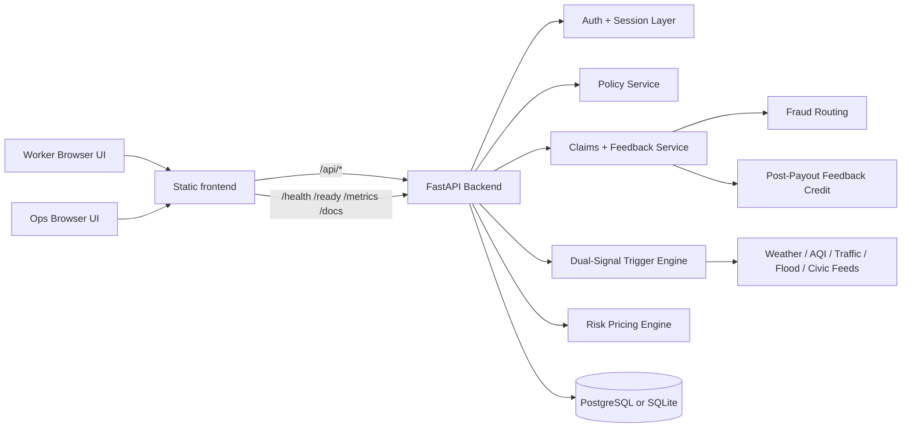
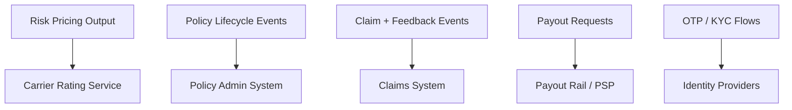

# GigBuddy Architecture

This document describes the architecture that exists in the repo today and the extension points for future carrier or fintech integrations.

## Current System

## Reviewer Highlights

### Worker side

- OTP, KYC, and UPI-backed onboarding flow
- policy purchase, renewal, pause, and reactivation
- multilingual worker UI
- claims history plus post-payout feedback

### Trigger side

- five disruption modes
- dual-signal validation before payout events are created
- live public feed support with calibrated fallback simulation

### Ops side

- review queue for held claims
- live zone intelligence
- runtime readiness and integration visibility

## Why The Feedback Loop Matters

Many demos stop at "automatic payout." GigBuddy also collects a worker-side signal after payout:

- the worker confirms whether disruption really happened
- the worker reports whether the payout was helpful
- the worker reports whether the shift stopped, slowed, or stayed normal
- the worker earns a renewal credit for participating

That gives the product a mechanism for improving trust and reducing basis-risk blind spots over time.

## Future Extension Points

The repo does not claim live carrier integrations by default, but it is organized so they can be added cleanly:

Recommended order:

1. real payout provider
2. real OTP and KYC providers
3. carrier policy sync
4. carrier claim event sync
5. analytics loop using accumulated payout feedback
